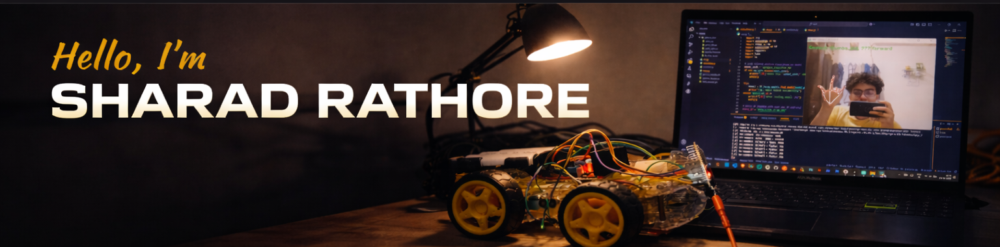
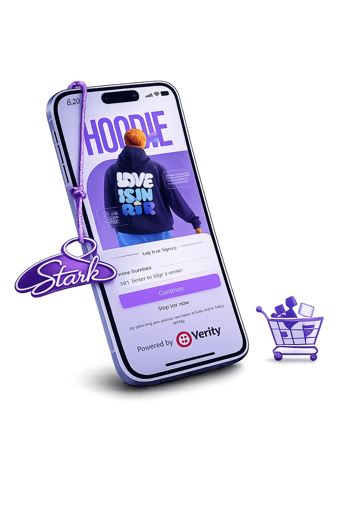
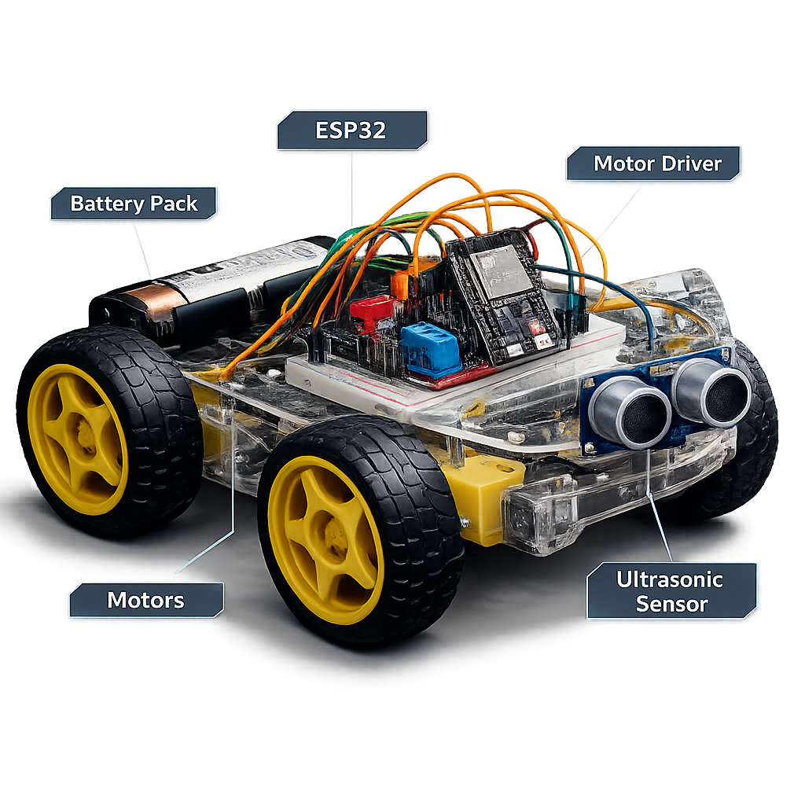
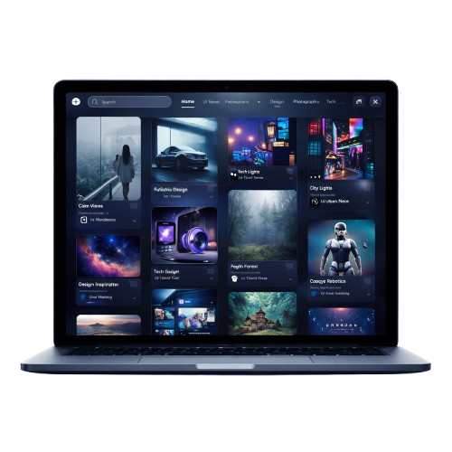
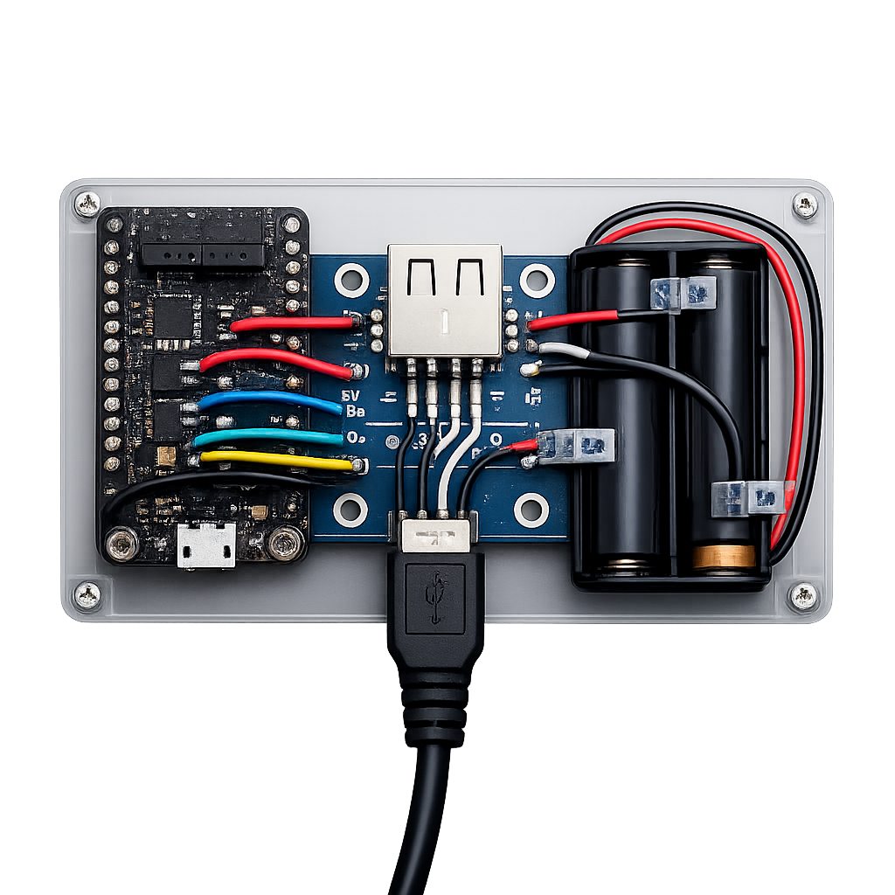

<!-- ================= HEADER ================= -->

<h1 align="center">Hi 👋, I'm Sharad Rathore</h1>
<h3 align="center">🚀 Full Stack • AI/ML • IoT Engineer</h3>

  
  

  

---

## 🧠 About Me

* 🔥 Problem-driven developer building **real-world systems**
* ⚡ Focused on **Scalable Backend + AI/ML + IoT**
* 🧩 Love solving complex engineering problems
* 🚀 Building systems, not just projects

---

## ⚡ Core Technologies

`MERN Stack` • `Redis` • `Elasticsearch` • `Computer Vision` • `IoT Systems` • `REST APIs`

---

## 🧰 Tech Stack

---

# 🚀 Featured Projects

## 🛒 Starkk.shop — Scalable MERN E-Commerce Platform

<table>
<tr>
<td width="60%">

🔥 Production-level **scalable backend architecture**

### ⚡ Highlights

* Redis caching for high-performance APIs
* Elasticsearch-powered product search
* Secure OTP authentication & payment integration
* Dynamic homepage rendering system
* Optimized API design reducing redundant calls

### 🧰 Tech Stack

`MongoDB` `Express.js` `React` `Node.js` `Redis` `Elasticsearch` `Razorpay` `Cloudinary`

### 🔗 Links

* Repo: https://github.com/sharadhkr/stark

</td>

<td width="40%">

</td>
</tr>
</table>

---

## 🤖 GestureBot — AI Gesture Controlled Robot

<table>
<tr>
<td width="60%">

🤖 AI + Robotics + Real-time Systems

### ⚡ Highlights

* Real-time hand gesture recognition
* Computer vision pipeline using MediaPipe
* ESP32 wireless control system
* Low latency gesture-to-action mapping

### 🧰 Tech Stack

`Python` `OpenCV` `MediaPipe` `ESP32`

</td>

<td width="40%">

</td>
</tr>
</table>

---

## 📌 CreatePin — Visual Sharing Platform

<table>
<tr>
<td width="60%">

🎨 Pinterest-style UI platform

### ⚡ Highlights

* Smooth animations using GSAP & Framer Motion
* Interactive board & pin system
* Responsive and modern UI

### 🧰 Tech Stack

`MongoDB` `Express` `Node.js` `EJS` `Framer Motion` `GSAP`

</td>

<td width="40%">

</td>
</tr>
</table>

---

## 🖨 Smart Thermal Printer Device

<table>
<tr>
<td width="60%">

🧠 IoT + Embedded Engineering

### ⚡ Highlights

* ESP32-based wireless printing system
* Browser-based print requests
* Real-time print job forwarding
* No driver installation required

### 🧰 Tech Stack

`ESP32` `Embedded Systems` `C` `HTML` `CSS`

</td>

<td width="40%">

</td>
</tr>
</table>

---

# 📊 GitHub Analytics

---

# 🐍 Contribution Snake

---

# 🚀 Current Focus

* ⚡ Scaling backend systems (Redis + caching)
* 🤖 Advanced computer vision projects
* 🌐 Real-time systems & networking
* 📡 IoT + distributed devices

---

# 🤝 Let's Connect

---

🔥 Building systems that solve real problems

